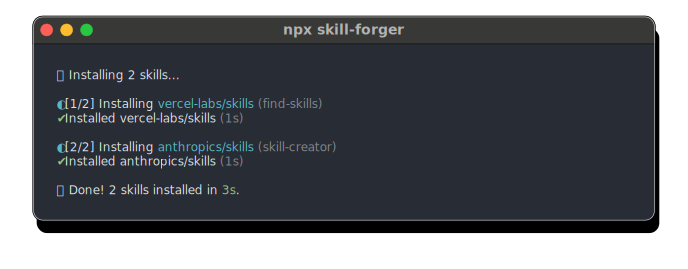
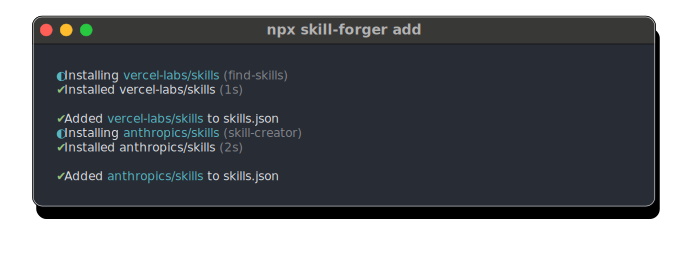

# ⚒️ skill-forger

Manage project Agent [skills](https://skills.sh/) from `skills.json`. Uses [`skills`](https://github.com/vercel-labs/skills) CLI under the hood.

## Usage

**Install all skills from `skills.json`:**

```bash
npx skill-forger
```

<p align="center">
  
</p>

**Add new skills to project:**

```bash
npx skill-forger add skills.sh/vercel-labs/skills/find-skills

npx skill-forger add anthropics/skills:skill-creator
```

<p align="center">
  
</p>

This creates a `skills.json` file:

```json
{
  "$schema": "https://unpkg.com/skill-forger/skills_schema.json",
  "skills": [
    { "source": "vercel-labs/skills", "skills": ["find-skills"] },
    { "source": "anthropics/skills", "skills": ["skill-creator"] }
  ]
}
```

## CLI Usage

```sh
npx skill-forger                    # Install skills from skills.json (default)
npx skill-forger install, i         # Same as above
npx skill-forger add <source>...    # Add skill source(s) to skills.json
```

### Commands

#### `install` (default)

Installs all skills defined in `skills.json`.

```sh
npx skill-forger install [options]
```

| Option           | Description                                       |
| ---------------- | ------------------------------------------------- |
| `--agent <name>` | Target agent (default: `claude-code`, repeatable) |
| `-g, --global`   | Install skills globally                           |
| `-h, --help`     | Show help                                         |

#### `add`

Adds skill source(s) to `skills.json` and installs them.

```sh
npx skill-forger add <source>... [options]
```

| Option           | Description                                       |
| ---------------- | ------------------------------------------------- |
| `--agent <name>` | Target agent (default: `claude-code`, repeatable) |
| `-h, --help`     | Show help                                         |

### Source Formats

Sources can be specified in multiple formats:

```sh
# GitHub owner/repo format
npx skill-forger add vercel-labs/skills

# skills.sh URL
npx skill-forger add https://skills.sh/vercel-labs/skills/find-skills
npx skill-forger add skills.sh/vercel-labs/skills/find-skills


# Multiple sources
npx skill-forger add org/repo-a:skill1 org/repo-b:skill2

# Specify skills (comma separated)
npx skill-forger add vercel-labs/agent-skills:vercel-deploy,vercel-react-native-skills
```

### Examples

```sh
# Install all skills from skills.json
npx skill-forger

# Add a skill source (all skills)
npx skill-forger add vercel-labs/skills

# Add specific skills from a source
npx skill-forger add vercel-labs/agent-skills:vercel-deploy,vercel-react-native-skills

# Add from skills.sh URL
npx skill-forger add https://skills.sh/vercel-labs/skills/find-skills

# Install skills globally
npx skill-forger install --global

# Install for multiple agents
npx skill-forger install --agent claude-code --agent cursor
```

<details>

<summary>local development</summary>

- Clone this repository
- Install [Bun](https://bun.sh)
- Install dependencies using `bun install`
- Run interactive tests using `bun run dev`

</details>

## License

Published under the [MIT](https://github.com/unjs/skill-forger/blob/main/LICENSE) license.
